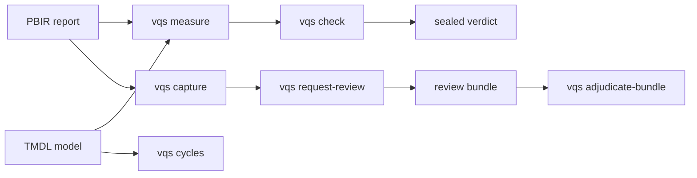

# Visual Quality System (VQS)

[](https://github.com/analienx/visual-quality-system/actions/workflows/ci.yml)
[](LICENSE)
[](pyproject.toml)

**Prove a Power BI report is good — from source, not vibes.** VQS measures check-ready facts straight from PBIR reports and TMDL models (contrast, palette, format consistency, metric units, bindings, DAX/M cycles), seals them into pass/fail/blocked verdicts, and binds rendered screenshots to exact source revisions so an independent reviewer can verify what actually shipped. No invented theme literals, no approval of your own fix, no pixel-only hand-waving.

## 60 seconds

```bash
pip install -e ".[test]"
vqs doctor                        # what external tools are present (never installs)
vqs cycles tests/powerbi/fixtures/clean_model
vqs measure tests/powerbi/fixtures/mini_report --model tests/powerbi/fixtures/mini_model/definition
python -m pytest                  # 139 tests, plus ruff clean
```

Real output (`vqs cycles`, exit 0):

```json
{
  "model_dir": "tests\\powerbi\\fixtures\\clean_model",
  "dax_objects": 2,
  "m_queries": 1,
  "dax_cycles": [],
  "m_cycles": [],
  "let_cycles": [],
  "acyclic": true
}
```

## How it works



Static facts come from parsing sources; rendered facts come from Desktop Bridge screenshots hashed against the source revision; the two meet in review bundles that a *different* reviewer adjudicates. Every observation is keyed to source hash, tool versions, and data scope. `pass`, `fail`, and `blocked` are distinct verdicts — unknowns block, they never pass.

## What runs today

| Command | Does | Status |
| --- | --- | --- |
| `vqs measure` | PBIR/TMDL facts: contrast, palette, cohorts, units, bindings | ✅ shipped (WP-19) |
| `vqs cycles` | Static DAX/M/`let` acyclicity gate | ✅ shipped |
| `vqs check` | Facts → sealed verdict under `.vqs-runs/` | ✅ shipped |
| `vqs capture` | Bridge screenshots + capture manifest | ✅ shipped |
| `vqs request-review` | Source-bound review template from renders | ✅ shipped |
| `vqs bundle` | Portable fixer→reviewer evidence bundles | ✅ shipped |
| `vqs adjudicate-bundle` | Independent static adjudication | ✅ shipped |
| `vqs doctor` | Capability report (pbir, Bridge, MCP, Desktop) | ✅ shipped |
| `vqs inventory` / `status` | PBIR inventory / ledger snapshot | ✅ shipped |
| Typed PBIR repairs | Allowlisted edits in disposable candidates | 🔶 planned ([WP-09](https://github.com/analienx/visual-quality-system/issues/14)) |
| Word/DOCX backend | Paginated all-page verification | 🔶 planned ([WP-08](https://github.com/analienx/visual-quality-system/issues/13)) |
| Fabric Apps | React/TS adapter | ⏸ deferred ([WP-13](https://github.com/analienx/visual-quality-system/issues/18)) |

Machine-readable status: [roadmap/STATUS.md](roadmap/STATUS.md) and [roadmap/work_packages.json](roadmap/work_packages.json). Program tracking: [issue #4](https://github.com/analienx/visual-quality-system/issues/4).

## Docs

- [User guide](docs/USER_GUIDE.md) — end-to-end workflows with copy-paste commands
- [Command reference](docs/CLI.md) — every `vqs` command
- [Architecture](docs/ARCHITECTURE.md) — system design + Power BI tool interfaces
- [Acceptance matrix](docs/ACCEPTANCE_MATRIX.md) — falsifiable gates G0–G6
- [Contributing](CONTRIBUTING.md) — setup, gates, PR rules
- [Changelog](CHANGELOG.md)
- [Agent/protocol rules](docs/LEDGER_AND_AGENT_PROTOCOL.md) · [AGENTS.md](AGENTS.md)

## Ecosystem: VQS owns the quality decision

VQS parses facts itself and uses first-party tools at arm's length: [pbir-cli](https://github.com/maxanatsko/pbir.tools) (optional, report-side only — [Custom Non-Commercial license](https://github.com/maxanatsko/pbir.tools/blob/main/LICENSE), VQS works without it), [Microsoft Power BI Modeling MCP](https://github.com/microsoft/powerbi-modeling-mcp) (live semantic models), [Desktop Bridge](https://www.npmjs.com/package/@microsoft/powerbi-desktop-bridge-cli) (captures). VQS has no ADOMD dependency. Details: [tool interfaces](docs/ARCHITECTURE.md#power-bi-tool-interfaces-decided-2026-09-26).

## Security

Default runs are local and private. Never commit business data, real screenshots, caches (`.abf`), credentials, or machine-local Desktop state — see [AGENTS.md](AGENTS.md) and the ledger protocol. Report security issues privately to the repo owner.

## License

Apache-2.0 — see [LICENSE](LICENSE) and [NOTICE](NOTICE).
