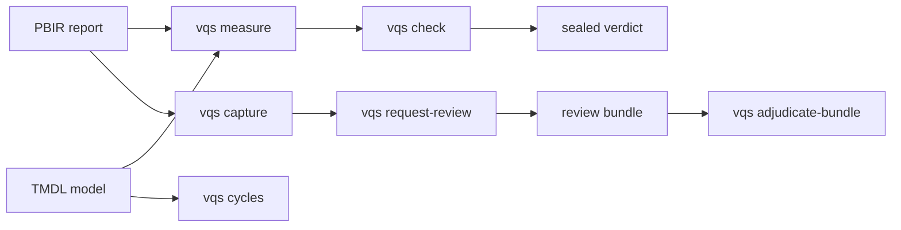

# Visual Quality System (VQS)

[](https://github.com/analienx/visual-quality-system/actions/workflows/ci.yml)
[](LICENSE)
[](pyproject.toml)

**Prove a Power BI report is good — from source, not vibes.** VQS measures check-ready facts straight from PBIR reports and TMDL models (contrast, format consistency, metric units, bindings, page insights, DAX/M cycles), seals them into pass/fail/blocked verdicts, and binds rendered screenshots to exact source revisions so an independent reviewer can verify what actually shipped. No invented theme literals, no approval of your own fix, no pixel-only hand-waving.

## 60 seconds

```bash
pip install -e ".[test]"
vqs --version
vqs doctor                        # capabilities + install identity (never installs)
vqs run tests/powerbi/fixtures/mini_report --mode review --run-root runs --run-id demo
python -m pytest                  # full suite green plus ruff clean
```

The demo review blocks (exit 2), honestly: the fixture mixes
slicer textSize declarations with an unknown effective value, so
the run reports `needs_render_evidence` instead of failing. The
low-level tool sequence (`measure`, `check`, `repair`, …) is the
expert/debug interface — see `docs/QUICKSTART.md`.

Real output (`vqs cycles`, exit 0):

```json
{
  "model_dir": "tests\\powerbi\\fixtures\\clean_model",
  "dax_objects": 2,
  "m_queries": 1,
  "dax_cycles": [],
  "m_cycles": [],
  "let_cycles": [],
  "acyclic": true
}
```

## How it works



Static facts come from parsing sources; rendered facts come from Desktop Bridge screenshots hashed against the source revision; the two meet in review bundles that a *different* reviewer adjudicates. Every observation is keyed to source hash, tool versions, and data scope. `pass`, `fail`, and `blocked` are distinct verdicts — unknowns block, they never pass.

## What runs today

| Command | Does | Status |
| --- | --- | --- |
| `vqs run` | One-command workflow: inspect → review → propose → repair → verify → remeasure | Implemented on this branch |
| `vqs measure` | PBIR/TMDL facts: contrast, cohorts, units, scoped bindings, page insights, duplication + chart-practice + layout checks | Implemented on this branch |
| `vqs cycles` | Static DAX/M/`let` acyclicity gate | Implemented on this branch |
| `vqs check` | Facts → sealed verdict under run roots (G0 observation) | Implemented on this branch |
| `vqs capture` | Bridge screenshots + capture manifest | Implemented on this branch; needs Desktop + Bridge |
| `vqs request-review` | Source-bound review template from renders | Implemented on this branch |
| `vqs bundle` | Portable fixer→reviewer evidence bundles | Implemented on this branch |
| `vqs adjudicate-bundle` | Independent static adjudication (never passes statically) | Implemented on this branch |
| `vqs doctor` | Capability + install-identity report (never installs or gates) | Implemented on this branch |
| `vqs inventory` / `status` | PBIR inventory / ledger snapshot | Implemented on this branch |
| Typed candidate repair | Allowlisted edits in disposable candidates + explicit authoring backends | Review candidate ([PR #31](https://github.com/analienx/visual-quality-system/pull/31), draft unmerged; [WP-09](https://github.com/analienx/visual-quality-system/issues/14)) |
| Word/DOCX backend | Paginated all-page verification | 🔶 planned ([WP-08](https://github.com/analienx/visual-quality-system/issues/13)) |
| Fabric Apps | React/TS adapter | ⏸ deferred ([WP-13](https://github.com/analienx/visual-quality-system/issues/18)) |

Implemented means the command works on this branch with hosted CI; nothing here is independently accepted — the ledger reports zero verified work packages. The trust boundaries are recorded in [ADR 0001](docs/adr/0001-r6-trust-boundaries.md).

Machine-readable status: [roadmap/STATUS.md](roadmap/STATUS.md) and [roadmap/work_packages.json](roadmap/work_packages.json). Program tracking: [issue #4](https://github.com/analienx/visual-quality-system/issues/4).

## Docs

- [Developer journey](docs/JOURNEY.md) — the supported installed-command walk, oracle-tested
- [User guide](docs/USER_GUIDE.md) — end-to-end workflows with copy-paste commands
- [Command reference](docs/CLI.md) — every `vqs` command
- [Architecture](docs/ARCHITECTURE.md) — system design + Power BI tool interfaces
- [Acceptance matrix](docs/ACCEPTANCE_MATRIX.md) — falsifiable gates G0–G6
- [Contributing](CONTRIBUTING.md) — setup, gates, PR rules
- [Changelog](CHANGELOG.md)
- [Agent/protocol rules](docs/LEDGER_AND_AGENT_PROTOCOL.md) · [AGENTS.md](AGENTS.md)

## Ecosystem: VQS owns the quality decision

VQS parses facts itself and uses first-party tools at arm's length: the Microsoft-guided `powerbi-report-author` executable (documented distribution channel `@microsoft/powerbi-report-authoring-cli`; optional, report-side validation only — VQS records an explicit direct fallback without it), [Microsoft Power BI Modeling MCP](https://github.com/microsoft/powerbi-modeling-mcp) (live semantic models), [Desktop Bridge](https://www.npmjs.com/package/@microsoft/powerbi-desktop-bridge-cli) (captures). VQS has no ADOMD dependency. Details: [tool interfaces](docs/ARCHITECTURE.md#power-bi-tool-interfaces-decided-2026-09-26).

## Security

Default runs are local and private. Never commit business data, real screenshots, caches (`.abf`), credentials, or machine-local Desktop state — see [AGENTS.md](AGENTS.md) and the ledger protocol. Report security issues privately to the repo owner.

## License

Apache-2.0 — see [LICENSE](LICENSE) and [NOTICE](NOTICE).
